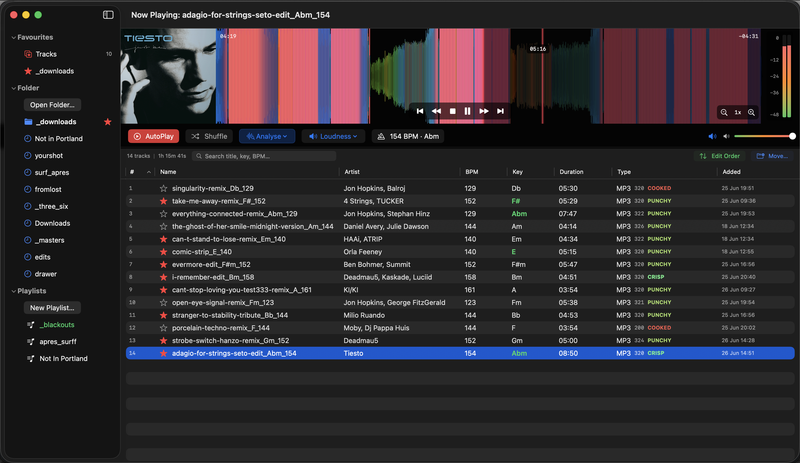
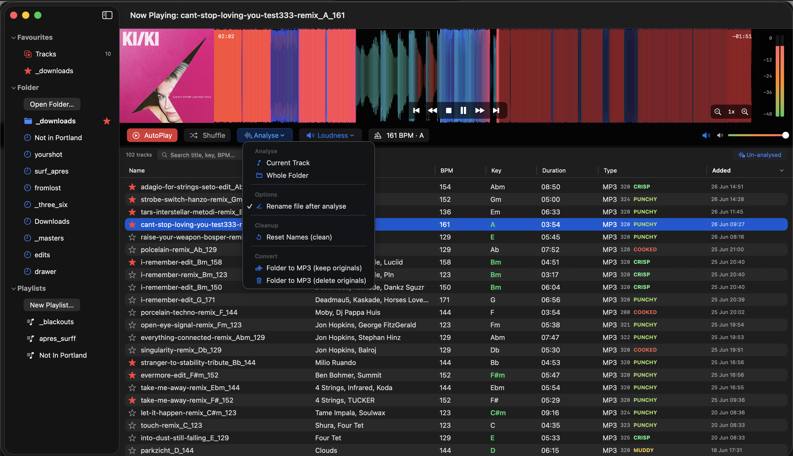
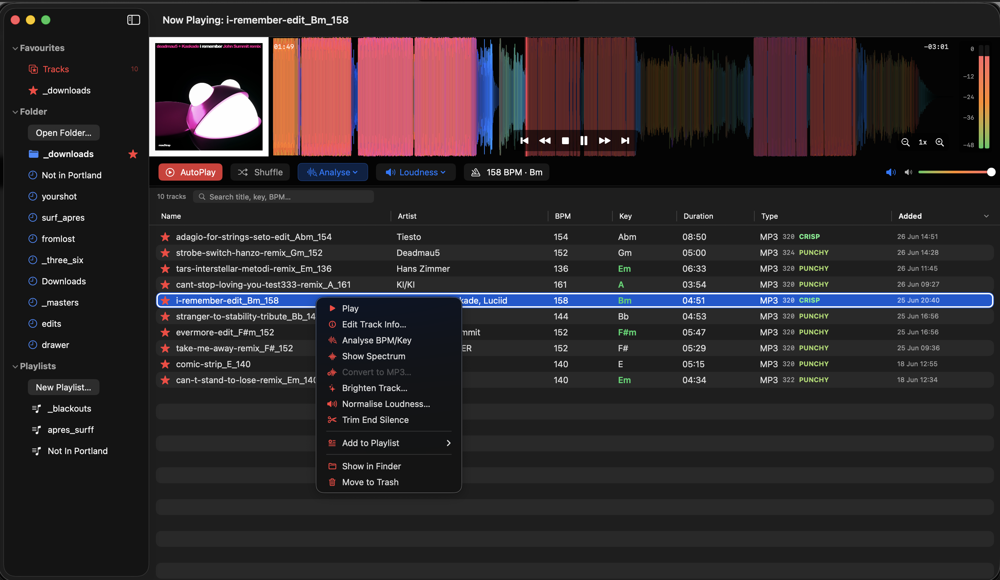
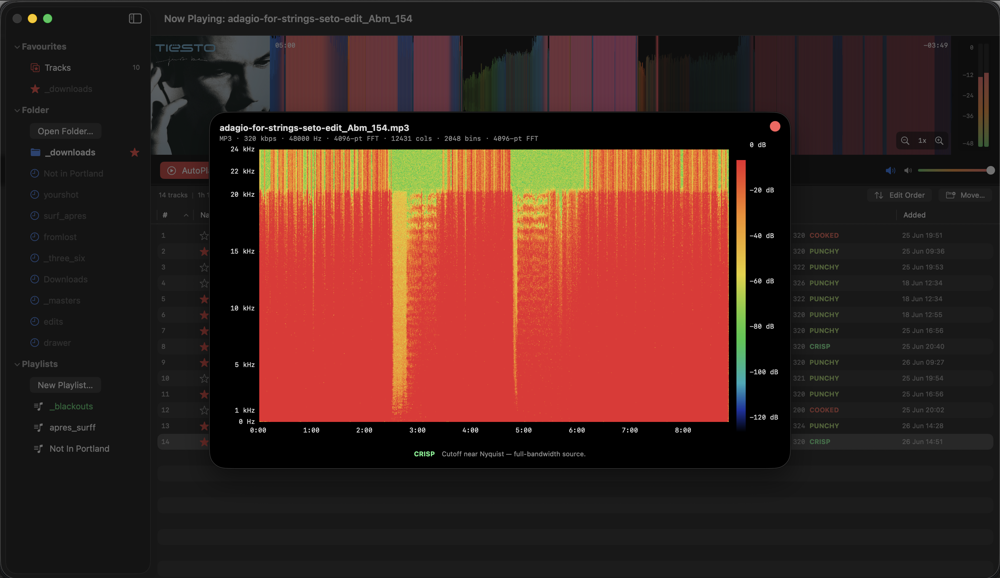

# Modulr User Guide

Modulr is a native macOS companion for DJs. It analyses, tags, and organises a
music library for harmonic mixing, with rekordbox-style RGB waveforms and
spectrograms.

## The main window

- **Sidebar** (left): Favourites (starred tracks and folders), Folders (open a
  folder, jump to recents), and Playlists. The accent colour follows the active
  source: blue for folders, green for playlists, red for favourites.
- **Waveform** (top): an RGB render where bass reads red, mids green, and treble
  blue. The red line is the playhead. A green-amber-red meter sits on the right.
- **Transport**: AutoPlay, Shuffle, Analyse, Loudness, and the live BPM and key.
- **Track table**: name, artist, BPM, key, duration, type, and date added.
  Folders sort newest-added first; playlists sort by track number.

## Getting started

1. Click **Open Folder…** in the sidebar and choose a folder of audio.
2. Supported formats: MP3, M4A, AAC, WAV, AIFF, FLAC.
3. Select any track to play it. Use the transport controls or the waveform to
   scrub.

## Analysing tracks

Open the **Analyse** menu to detect BPM and key:

- **Current Track** or **Whole Folder**.
- **Rename file after analyse** writes the DJ-format name `title_KEY_BPM`.
- **Reset Names (clean)** strips the `_KEY_BPM` suffix back off.

Toggle **Un-analysed** (top right) to show only tracks missing BPM or key, then
analyse them in one pass. The filter clears itself once none remain.

## Harmonic mixing

While a track plays, keys that are Camelot-compatible with it are highlighted in
**green** in the Key column, so the next track to mix into is obvious at a glance.

## Per-track actions

Right-click any track:

- **Edit Track Info** opens the tag editor (title prefills from the filename for
  untagged tracks).
- **Analyse BPM/Key** and **Show Spectrum**.
- **Convert to MP3**, **Brighten Track**, **Normalise Loudness**, and
  **Trim End Silence** (cuts trailing silence over ten seconds).
- **Add to Playlist**, **Show in Finder**, **Move to Trash**.

## Quality and the spectrum

Every track gets a quality verdict in the Type column, derived from its spectral
cutoff:

- **Crisp**: full-bandwidth source.
- **Punchy**: 320 kbps MP3 or transparent AAC.
- **Muddy**: likely 192 to 256 kbps.
- **Cooked**: likely 128 kbps or below.

**Show Spectrum** opens a full spectrogram. Colour encodes energy (black for
silence rising to red at the loudest), and the footer reports the detected
cutoff frequency.

## Playlists and favourites

- **New Playlist…** in the sidebar, then drag tracks onto it.
- Star a track to add it to **Favourites > Tracks**; star a folder to pin it.
- Reorder a playlist with **Edit Order**, or **Move…** its tracks into one folder.
